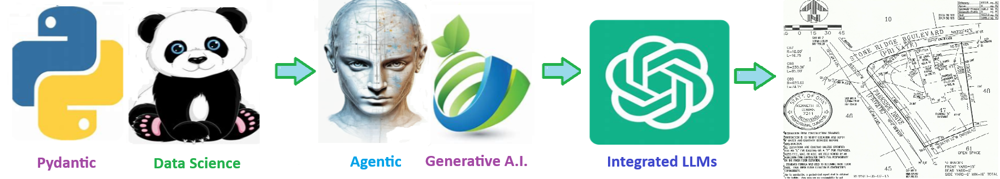

# 🏗️ AI Grading Plan Assistant

#### An AI first assistant for Grading projects

> Executive Sponsor **Joe Nemmer, Executive Vice President, SGI**  
> Subject Matter Experts **Mary , Paul**  
> Created by **ThriveAI  ...      Joe Eberle**  
> 🗓️ Started: November 10, 2025 
> 📫 Contact: [josepheberle@outlook.com](mailto:josepheberle@outlook.com)  
> 🔗 GitHub: [JoeEberle](https://github.com/JoeEberle/)

## 🧠 AI Grading Plan Assistant – Intelligent Projects for Civil Engineering

The integration of AI into the property grading process enhances precision, efficiency, and consistency in civil engineering 
design by automating repetitive drafting and compliance checks. Through intelligent analysis of CAD drawings and site data, 
AI tools can rapidly identify grading conflicts, optimize cut-and-fill balance, and ensure alignment with municipal 
and industry standards.

This augmentation enables engineers to focus on higher-value tasks such as design judgment, stakeholder coordination,
and quality assurance rather than manual data handling. By leveraging AI, firms can improve workforce productivity,
reduce rework, and deliver safer, more sustainable, and cost-effective development projects.

### 🌐 Establishing a Shareable Knowledge Corpus
Every subdivision, township, and municipality maintains unique grading requirements, review procedures, and documentation formats that can change frequently and differ widely between jurisdictions. Maintaining awareness of these variations is an ongoing challenge, particularly as projects scale and regulations evolve.  
Creating a **shareable AI-driven knowledge corpus** allows this expertise—local grading standards, design templates, regulatory thresholds, and field insights—to be captured, organized, and continuously updated across teams. Such a system ensures that both experienced and newly onboarded staff have immediate access to consistent, validated knowledge, reducing dependency on individual expertise.  
In times of staff turnover or shortages, AI can further **augment capacity** by guiding plan preparation, flagging compliance gaps, and helping new engineers apply community-specific standards with confidence and accuracy.

##  🏗 Architecture & Workflow Considerations

## 1. ⚙️ Data ingestion / baseline model

1.1 Import existing site topography, parcel boundaries, survey data (e.g., LiDAR, GIS shapefiles) into your CAD/BIM environment.
1.2 Use AI to assist with surface generation, contours, and initial grading envelopes (cut/fill zones).

## 2. 📄 Automated drawing generation

2.1 Use a drafting automation tool (e.g., DraftAid, MecAgent) to apply your drawing templates, annotate finished grade, slope arrows, elevation callouts, drainage details, etc.
2.2 Create draft grading sheets for each subdivision unit.

## 3. 📏 Compliance checks & rule-based validation

3.1 Encode your local town’s grading/regulation rules: slope limits, drainage swale cross-section, setbacks, buffer zones, earthwork volume thresholds, ADA criteria, etc.
3.2 Use an AI/ML module (or custom script) to parse the drawing or model: measure slopes, check elevation differences, detect non-compliant geometry. For example: Civils.ai can measure and check requirements in drawings.

## 4. ⚙️ Generate a compliance-report or mark-up drawing highlighting violations.

4.1 Iteration & optimization
4.2 Use generative design: given the constraints (parcel footprint, maximum slope, drainage requirements), use AI to propose alternative grading schemas. (Relevant research: generative AI in structural/BIM design.) 
arXiv
4.3 Review the alternatives, select one, refine details, and finalize.

## 5. 📄 Documentation & export

5.1 Export finalized drawings: grading plan sheets, cut/fill volume tables, earthwork sequence sheets, annotations.
5.2 Automate summary reports: area of cut, volume of fill, material import/export, cost estimates.
5.3 Archive versions and compliance reports for audit trail (very useful for your professional context).
5.4 Integration & tracking
5.5 Integrate with your GIS, town permitting system, or data-warehouse so you can link the drawings to the subdivisions, property metadata, compliance status, revision history.

## 6. Log Schedule 
6.1 Automate alerts if new subdivisions or grading plans are added that need review.

